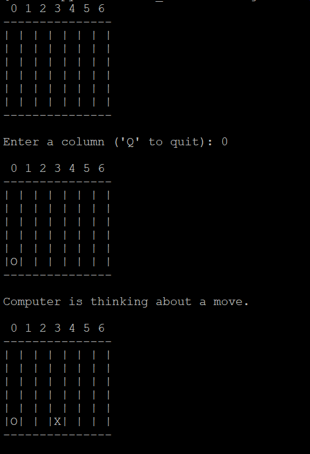

# connect4
Connect 4 is a two-player connection game where the players take turns dropping colored discs (In this case, O and X) from the top into a vertically suspended grid. The objective of the game is to be the first to form a horizontal, vertical, or diagonal line of four of one's own discs.

The program uses a number of helper functions, including printBoard, which prints the current state of the game board; userMove, which prompts the user for their next move and ensures that it is a valid move; makeMove, which places a piece on the board; computerMove, which determines the computer's move using the minimax algorithm; winningMove, which checks if the most recent move resulted in a win for the current player; and heurFunction, which assigns a heuristic value to a given set of pieces on the board.

Player's piece - O
Computer's piece - X

Use "make all" to compile 
Use "./connect4" to start

